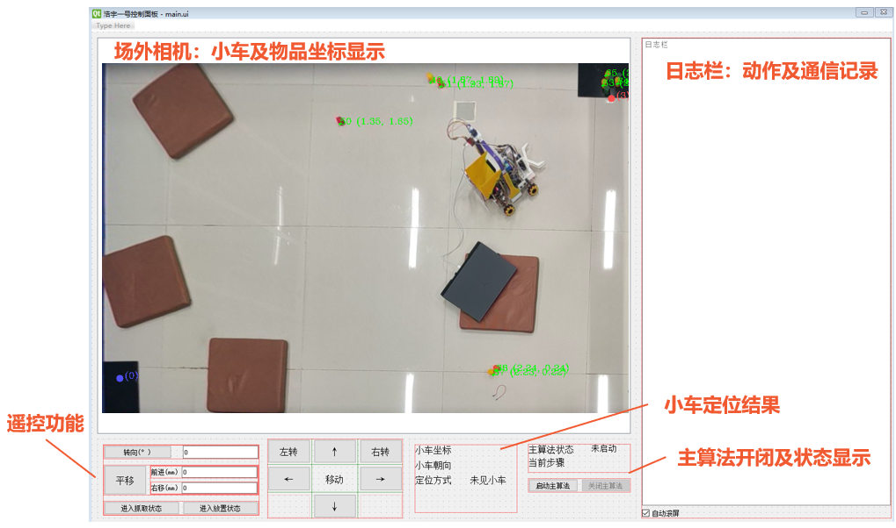
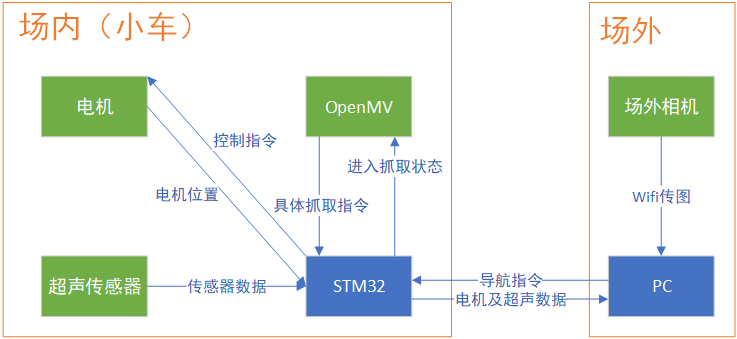
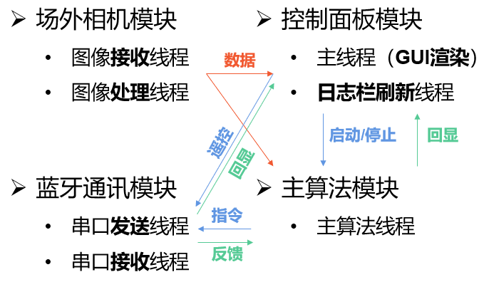
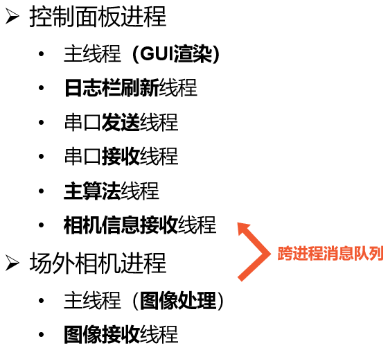

# 清华大学2023年“智能机电系统实践”——“场外相机组”代码库
*长江后浪推前浪，世上今人胜古人。预祝小学期玩得开心~*

  
  
控制面板示意图

## 系统结构
- **系统通信示意图**
  

    
  

- 模块**逻辑结构**图
  

- 软件**实际结构**图
  

    
  

## 代码文件结构
#### PC端场外相机及主循环：`PC_Python_project`文件夹
- 场外相机图像处理：`camera`文件夹
- 控制面板及主循环：`control_panel`文件夹
  - 蓝牙通信：`communication.py`
  - 控制面板UI（详见封面示意图）：`ui_main_window.py`
  - 控制面板逻辑及主循环：`control_panel.py`
#### OpenMV端程序：`OpenMV`文件夹
- 通信协议实现：`message.py`
- 舵机（夹爪）控制：`myservo.py`
- 各模式主循环：`OpenMV.py`
#### STM32端运动控制及指令处理程序：`STM32_project`文件夹
- 运动函数：`move.hpp/cpp`
- 指令队列：`STM_queues.hpp/cpp`
- 主程序及设置：`main.cpp`
